# so final project

**Universidad Icesi**  
**Curso:** Sistemas Operativos  
**Estudiantes:** steven montealegre, miguel isaza, edisson guerrero  
**Codigos:** A00014976, A00054628, A00328068  
**Correos:** james.montealegre@correo.icesi.edu.com, miguel11andres@hotmail.com,edixon_guerrero96@hotmail.com 


### Instalacion LXC/LXD:

1. Se intala Ubuntu Xenial, durante la instalacion se crea un usuario operativos.luego instalamos sudo para poder tener permisos en todos los usuarios y agregamos al archivo sudoers el usuario operativos. LXC ya viene instalado en esta version de ubuntu .

```
  usermod -aG sudo operativos 
```   


2. agregamos al usuario operativos al grupo lxd,  Para poder acceder al administrador de contendores con el comando:

```
sudo usermod --append --groups lxd operativos
```

el **storage pool** es un conjunto de discos en el que el servidor de Data Protection Manager (DPM) almacena réplicas, instantáneas y registros de transferencia. Antes de que pueda comenzar a proteger los datos, debe agregar al menos un disco al grupo de almacenamiento. Los discos agregados al grupo de almacenamiento deben estar vacíos. Para prepararse para la protección de datos, DPM reformatea los discos y borra cualquier dato en ellos.

**ZFS** es un sistema de ficheros,es una manera de gestionar el contenido que se almacena en el disco en un formato determinado.
este sistema tiene muchas ventajas:
```
.se diseñó desde un principio como un sistema de 128 bits, de forma que en la práctica será casi imposible alcanzar sus límites.
```
```
.ofrece integridad de datos comprobable, de forma que los datos en disco siempre sean correctos
```
```
.el sistema es autorreparable
```
```
.la creación de un sistema de ficheros es una operación muy ligera
```
```
.ZFS ofrece compresión transparente al usuario, lo que maximiza el espacio disponible en disco y, muchas veces, la velocidad de lectura
```

 configuración de red por defecto para los contenedores está definida en el fichero /etc/default/lxd-bridge.
Básicamente allí se especifica:

**.Que en el anfitrión se declara un puente: lxdbr0 (recordar que los puentes se pueden inspeccionar/gestionar con brctl)**
**.Que se modificará el perfil por defecto de los contenedores para que hagan uso del puente.**
Por defecto están vacíos, pero hay campos para especificar la IP del puente y el rango de concesiones DHCP a utilizar para los contenedores.
La configuración de los equipos del aula utiliza el fichero /etc/network/interfaces para incluír la interfaz de red física como un puerto del puente, de tal manera que los contenedores puedan acceder a la LAN del aula tal y como lo hacen las estaciones físicas.

**instalamos la herramienta de línea de comandos para administrar sistemas de archivos zfsutils**
```
sudo apt-get update
sudo apt-get install zfsutils-linux
```

3. Ahora se configura el proceso de inicializacion de los contenedores: 
```
sudo lxd init
```
 se crea un storage pool, lo cual nos permite agrupar la capacidad de varios discos.

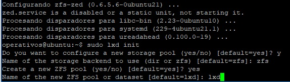  


Indicamos que se usara un directorio pre-asignado para el almacenamiento de los contenedores para esto 
se debe especificar el directorio y crear un volumen. tambien se debe especificar el espacio de disco que
se asignará. Se recomienda 15GB pero para este proyecto solo se usaron 10GB.

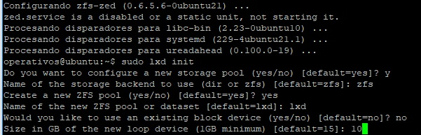 

4. Configuramos la Red de los contenedores, configurando un puente de red.
```
Do you want to configure the LXD bridge (yes/no) [default=yes]? yes
```
Esto abre una pantalla para realizar el proceso:
**primero se coloca el nombre de la interfaz del puente**

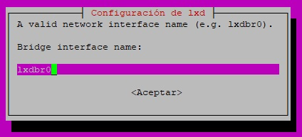 

- Seteamos una subnet IPv4, lo cual creara una subred random para los contenedores, permitiendo que se puedan comunicar entre contenedores.  
- Aceptamos la ip IP generada.  

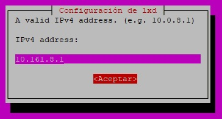 

- Aceptamos la mascara de red  

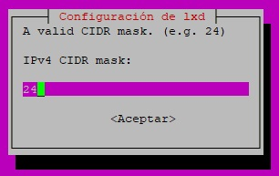 

- Aceptamos la primera IP y la ultima IP del servicio DHCP, que asigna un ip a cada contenedor que le pida una IP de la subred al
servicio.  

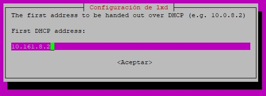 

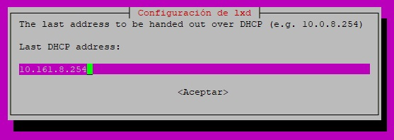 

- aceptamos el numero maximo de clientes DHCP

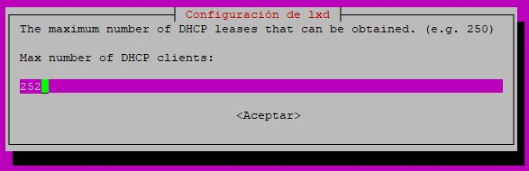 

- Aceptamos que permita NAT para el trafico IP, con el objetivo que haya una IP que nos permita navegar a internet.

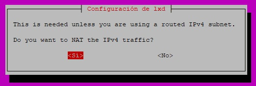 

### Creación contenedores con Servicio WEB

Para crear los contenedores que tendran el servicio web usamos el siguiente comando, especificando el nombre del contenedor.
```
lxc launch ubuntu:x webserver1
lxc launch ubuntu:x webserver2
```

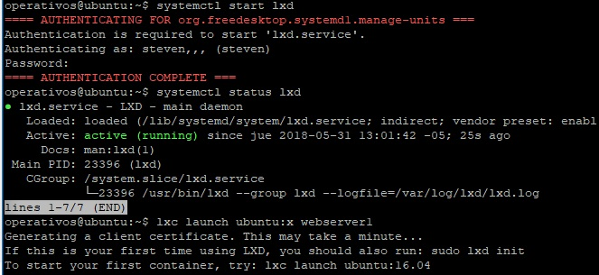 

Luego debemos ingresar a cada contenedor para configurar el servidor web:
```
lxc exec webserver1 -- sudo --login --user webserver1
```
Instalamos Nginx para la configuración del servidor web:
```
sudo apt-get install nginx
```
Se ingresa a la pagina web por default del sevidor, y se modifica el archivo, para que retorne una pagina html con los nombres de cada contenedor:

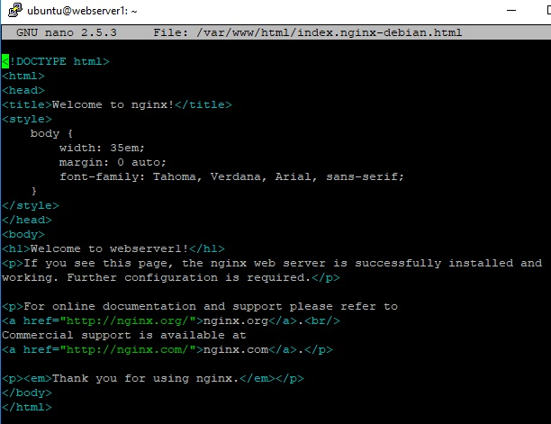 

 Reiniciamos el servicio nginx y salimos del contenedor, usando el comando: 

```
sudo service nginx restart
logout
```
**Repetimos el mismo proceso para el Webserver 2**  
Cambiamos el titulo en la pagina web por: Welcome to Webserver2. Para poder diferenciarlos.  

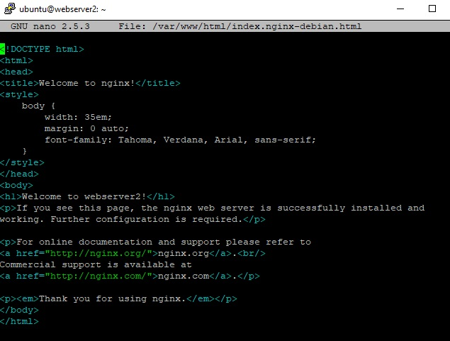 

### Creación Balanceador de Carga

Se crea el balanceador de carga:
```
lxc launch ubuntu:x loadBalancer
```
Se ingresa al balanceador de carga para configurarlo, usando el comando:
```
lxc exec loadBalancer -- sudo --login --user ubuntu
```

Instalamos Nginx, el cual tambien se puede confirgurar como balanceador de carga y actuar como proxy para los servidores Web.
```
sudo apt-get install nginx
```

Configuramos el balanceador de carga, editando el siguiente archivo:

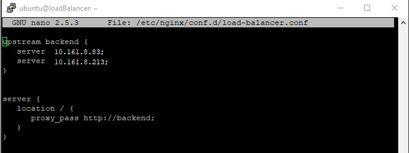

Lo que se configura es un bloque de servidores a los cuales se les pasara las peticiones.
Para Ubuntu, se debe eliminar la pagina por default, para que cuando se hagan solicitudes al balanceador no retorne la pag html, y
ademas se reinicia el servicio nginx:

El servicio queda activo, y usando systemctl se valida:  
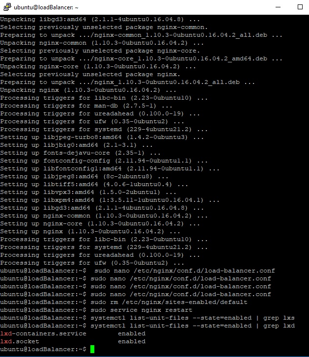 

### Prueba de LXC List
Usando el siguiente comando podemos ver los contenedores que se han creado.  

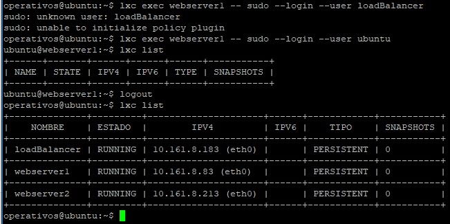  

### Pruebas de carga del Balanceador

Se realizan peticiones por medio de Curl al balanceador:

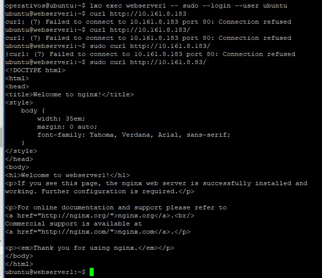  

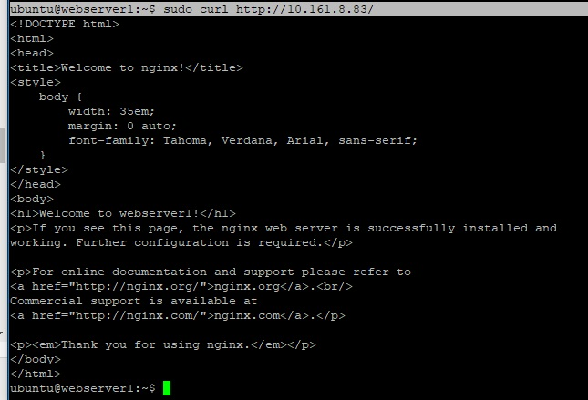 

Para las pruebas de carga se modifican las disponiblidad de recursos de los contenedores web, usando los siguientes comandos:

- Para cambiar el porcentaje de CPU:  (#: numero de webserver)
```
lxc config set webserver# limits.cpu.allowance 100%
lxc config set webserver# limits.cpu.allowance 50%
```

- Para cambiar la cantidad de memoria RAM:  (#: numero de webserver)
```
lxc config set webserver# limits.memory 64MB
lxc config set webserver# limits.memory 128MB
```
Para realizar las pruebas se usa siege:
-Se instala:
```
sudo apt-get install apache2-utils
sudo apt-get install siege
```

Se corre el siguiente comando, para cada combinacion de CPU: 50%-100% y MEM: 64MB-128MB, los cuales son pruebas de estres realizadas al balanceador de carga y se realizan para los dos servidores web
```
siege -c 100 -t 30s http://10.161.8.183/
```
 Resultados webserver1:

**CPU: 100% - RAM: 128MB:**  

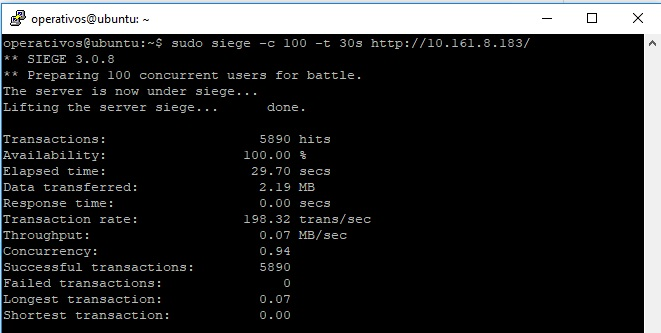

**CPU: 100% - RAM: 64MB:**   

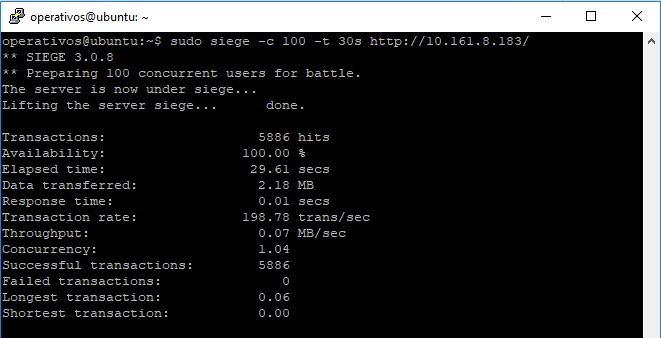

**CPU: 50% - RAM: 128MB:**   

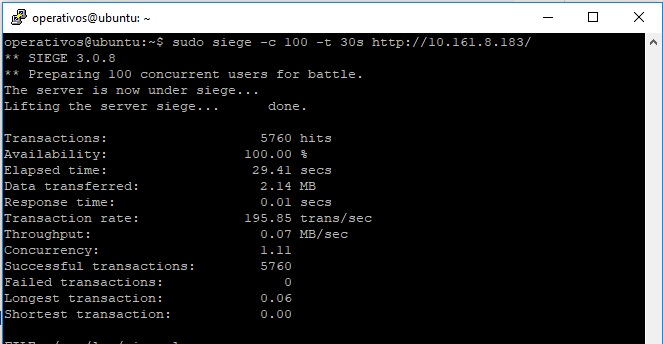

**CPU: 50% - RAM: 64MB:**  

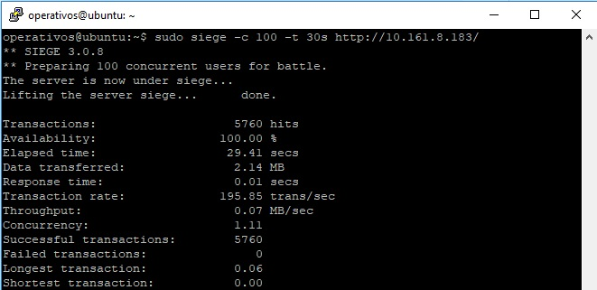

 Resultados webserver2:

**CPU: 100% - RAM: 128MB:**  

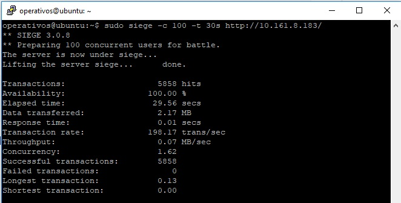

**CPU: 100% - RAM: 64MB:**   

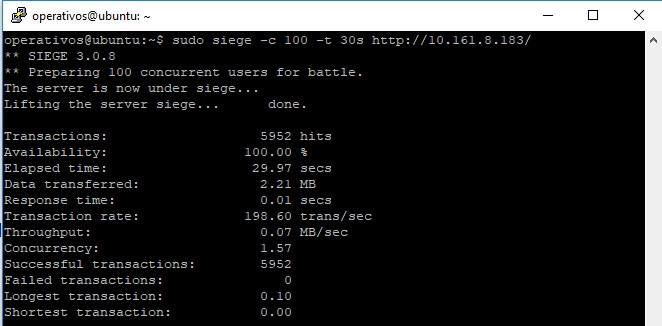

**CPU: 50% - RAM: 128MB:**   

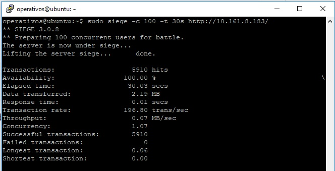

**CPU: 50% - RAM: 64MB:**  

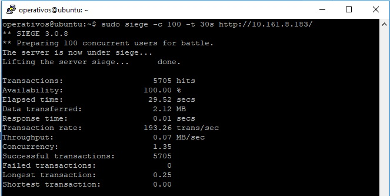

### Acceso desde SO anfitrion
Para permitir las peticiones al balanceador de carga desde el SO anfitrion se debe crear una regla de FORWARDING en el SO Ubuntu, por medio de los siguientes comandos:
```
PORT=80 PUBLIC_IP=172.30.179.119 CONTAINER_IP=10.161.8.183 \
sudo iptables -t nat -I PREROUTING -i enp0s8 -p TCP -d $PUBLIC_IP --dport $PORT -j DNAT --to-destination $CONTAINER_IP:$PORT -m comment --comment "forward to the Nginx container"
```
Por medio del navegador Chrome se hacen peticiones, a la IP del servidor (172.30.179.119)
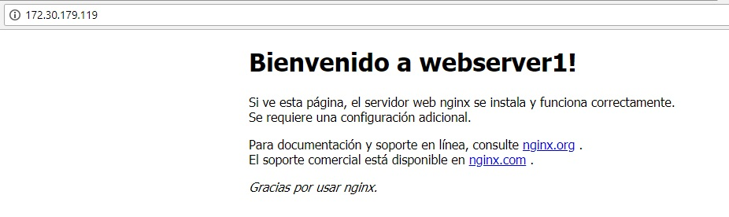
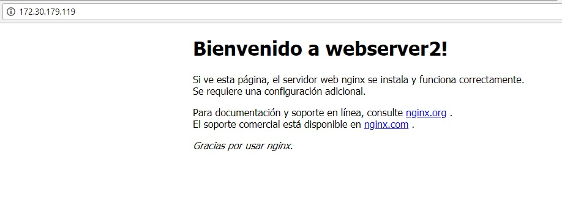


### Opcional

1. Cuando se reinicia una maquina virtual, los contenedores quedan en el ultimo estado en el cual se encontraban.  
Ya sea en estado RUNNING o STOPPED.
